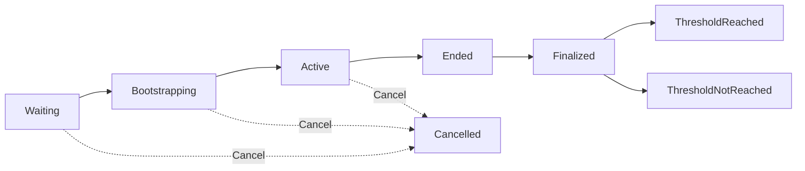

## Overview

The `StreamState` type represents the core state of a token stream, tracking distribution, balances, and status.

```rust
pub struct StreamState {
    pub dist_index: Decimal256,
    pub out_remaining: Uint256,
    pub in_denom: String,
    pub in_supply: Uint256,
    pub spent_in: Uint256,
    pub shares: Uint256,
    pub current_streamed_price: Decimal256,
    pub out_asset: Coin,
    pub status_info: StatusInfo,
    pub threshold: Option<Uint256>,
}
```

## Fields

### dist_index

<ParamField path="dist_index" type="Decimal256">
  **Distribution Index** - The cumulative amount of `out_asset` tokens that each share is entitled to receive.
  
  This is the key to efficient pro-rata distribution without iterating over all positions.
</ParamField>

**How it works:**
- Starts at `0`
- Increases as tokens are distributed over time
- Each position tracks its own `index` to calculate new purchases
- Purchase calculation: `new_purchased = shares * (stream.dist_index - position.index)`

**Example:**
```typescript
// If dist_index increased from 0.5 to 0.7
// And a position has 1000 shares
const newPurchase = 1000 * (0.7 - 0.5); // = 200 tokens
```

---

### out_remaining

<ParamField path="out_remaining" type="Uint256">
  **Remaining Output Tokens** - Amount of `out_asset` tokens not yet distributed.
  
  Decreases over time as tokens are streamed to subscribers.
</ParamField>

**Calculation:**
```
out_remaining = total_out_asset - distributed_so_far
```

**Progress tracking:**
```typescript
const totalOut = BigInt(stream.out_asset.amount);
const distributed = totalOut - BigInt(stream.out_remaining);
const percentComplete = (distributed * 100n) / totalOut;
```

---

### in_denom

<ParamField path="in_denom" type="string">
  **Input Denomination** - The token denomination accepted for subscriptions.
  
  Examples: `"uosmo"`, `"ibc/..."`
</ParamField>

This is the payment token that subscribers use to purchase the output tokens.

---

### in_supply

<ParamField path="in_supply" type="Uint256">
  **Input Supply** - Total amount of `in_denom` tokens currently subscribed but not yet spent.
  
  This represents the unspent balance across all positions.
</ParamField>

**Key points:**
- Increases when users subscribe
- Decreases when users withdraw
- Decreases as tokens are spent purchasing `out_asset`

---

### spent_in

<ParamField path="spent_in" type="Uint256">
  **Spent Input Tokens** - Total amount of `in_denom` tokens spent purchasing `out_asset`.
</ParamField>

**Relationship:**
```
total_subscribed = in_supply + spent_in
```

**Usage:**
- Determines revenue for creator
- Used to check if threshold is met
- Basis for exit fee calculation

---

### shares

<ParamField path="shares" type="Uint256">
  **Total Shares** - Sum of all shares across all positions.
  
  Shares determine each position's portion of distributed tokens.
</ParamField>

**Distribution calculation:**
```typescript
// Position's share of distribution
const positionShare = position.shares / stream.shares;
const positionTokens = totalDistributed * positionShare;
```

**Share changes:**
- Increases when users subscribe
- Decreases when users withdraw or exit

---

### current_streamed_price

<ParamField path="current_streamed_price" type="Decimal256">
  **Current Streaming Price** - The instantaneous price at which tokens are currently being distributed.
  
  This is the marginal price, not the average price.
</ParamField>

**Characteristics:**
- Increases over time (tokens become more expensive)
- Represents the "ask" price at the current moment
- Used to calculate fair share allocation for new subscribers

**Price evolution:**
```
Time:   t0    t1    t2    t3
Price:  0.1   0.2   0.5   1.0  (increasing)
```

---

### out_asset

<ParamField path="out_asset" type="Coin">
  **Output Asset** - The total amount of tokens being distributed.
  
  Structure: `{ "denom": "...", "amount": "..." }`
</ParamField>

This is set at stream creation and represents the initial supply.

---

### status_info

<ParamField path="status_info" type="StatusInfo">
  **Status Information** - Detailed status and timing information.
  
  See [StatusInfo](#statusinfo-structure) below.
</ParamField>

---

### threshold

<ParamField path="threshold" type="Option<Uint256>">
  **Success Threshold** - Optional minimum amount of `spent_in` required for stream success.
  
  If not met by `end_time`, all subscribers receive full refunds.
</ParamField>

**Checking threshold:**
```typescript
const thresholdMet = stream.threshold 
  ? BigInt(stream.spent_in) >= BigInt(stream.threshold)
  : true; // No threshold = always met
```

---

## StatusInfo Structure

```rust
pub struct StatusInfo {
    pub status: Status,
    pub bootstrapping_start_time: Timestamp,
    pub start_time: Timestamp,
    pub end_time: Timestamp,
    pub last_updated: Timestamp,
}
```

### status

<ParamField path="status" type="Status">
  Current lifecycle status of the stream.
</ParamField>

### Status Enum

```rust
pub enum Status {
    Waiting,
    Bootstrapping,
    Active,
    Ended,
    Finalized(FinalizedStatus),
    Cancelled,
}

pub enum FinalizedStatus {
    ThresholdReached,
    ThresholdNotReached,
}
```

#### Status Descriptions

<AccordionGroup>
  <Accordion title="Waiting">
    **Initial state after stream creation**
    
    - No user interactions allowed
    - Stream admin can cancel
    - Transitions to Bootstrapping at `bootstrapping_start_time`
  </Accordion>
  
  <Accordion title="Bootstrapping">
    **Pre-stream subscription period**
    
    - Users can subscribe and withdraw
    - No token streaming occurs yet
    - Builds initial liquidity
    - Transitions to Active at `start_time`
  </Accordion>
  
  <Accordion title="Active">
    **Main streaming phase**
    
    - Tokens are continuously distributed
    - Users can subscribe, withdraw, sync positions
    - Price increases over time
    - Transitions to Ended at `end_time`
  </Accordion>
  
  <Accordion title="Ended">
    **Stream completed, awaiting finalization**
    
    - Stream admin must call finalize
    - No new subscriptions
    - Subscribers cannot exit yet (must wait for finalization)
  </Accordion>
  
  <Accordion title="Finalized(ThresholdReached)">
    **Successfully completed**
    
    - Threshold met (or no threshold set)
    - Revenue distributed to creator
    - Subscribers can exit and receive purchased tokens
    - Exit fees applied
  </Accordion>
  
  <Accordion title="Finalized(ThresholdNotReached)">
    **Failed - threshold not met**
    
    - Threshold was set but not reached
    - All subscribers receive full refunds
    - Creator receives back all output tokens
    - No fees charged
  </Accordion>
  
  <Accordion title="Cancelled">
    **Emergency cancellation**
    
    - Cancelled by protocol admin or stream admin (during Waiting)
    - All subscribers receive full refunds
    - Creator receives back all output tokens
    - No fees charged
  </Accordion>
</AccordionGroup>

### Timing Fields

<ParamField path="bootstrapping_start_time" type="Timestamp">
  Nanosecond timestamp when bootstrapping phase begins.
</ParamField>

<ParamField path="start_time" type="Timestamp">
  Nanosecond timestamp when active streaming begins.
</ParamField>

<ParamField path="end_time" type="Timestamp">
  Nanosecond timestamp when streaming ends.
</ParamField>

<ParamField path="last_updated" type="Timestamp">
  Nanosecond timestamp when stream state was last synchronized.
</ParamField>

---

## Stream Lifecycle Diagram



---

## Example: Complete Stream State Query

```typescript
import { SigningCosmWasmClient } from '@cosmjs/cosmwasm-stargate';

async function analyzeStream(client: SigningCosmWasmClient, streamAddress: string) {
  const stream = await client.queryContractSmart(streamAddress, {
    stream: {},
  });
  
  // Calculate key metrics
  const totalOut = BigInt(stream.out_asset.amount);
  const distributed = totalOut - BigInt(stream.out_remaining);
  const progress = Number(distributed * 100n / totalOut);
  
  const totalSubscribed = BigInt(stream.in_supply) + BigInt(stream.spent_in);
  
  const thresholdMet = stream.threshold
    ? BigInt(stream.spent_in) >= BigInt(stream.threshold)
    : true;
  
  console.log(`Stream: ${stream.name}`);
  console.log(`Status: ${stream.status}`);
  console.log(`\nProgress: ${progress.toFixed(2)}%`);
  console.log(`Distributed: ${distributed} / ${totalOut}`);
  console.log(`\nSubscription Stats:`);
  console.log(`  Total subscribed: ${totalSubscribed}`);
  console.log(`  Unspent: ${stream.in_supply}`);
  console.log(`  Spent: ${stream.spent_in}`);
  console.log(`  Total shares: ${stream.shares}`);
  console.log(`\nPricing:`);
  console.log(`  Current price: ${stream.current_streamed_price}`);
  console.log(`\nThreshold:`);
  console.log(`  Required: ${stream.threshold || 'None'}`);
  console.log(`  Met: ${thresholdMet ? 'Yes' : 'No'}`);
  
  // Check current phase
  const now = Date.now() * 1_000_000; // Convert to nanoseconds
  const startTime = Number(stream.start_time);
  const endTime = Number(stream.end_time);
  
  if (now < startTime) {
    const timeUntilStart = (startTime - now) / 1_000_000_000;
    console.log(`\nStarts in: ${timeUntilStart.toFixed(0)} seconds`);
  } else if (now < endTime) {
    const timeRemaining = (endTime - now) / 1_000_000_000;
    console.log(`\nTime remaining: ${timeRemaining.toFixed(0)} seconds`);
  } else {
    console.log(`\nStream has ended`);
  }
  
  return stream;
}
```

---

## Related Types

<CardGroup cols={2}>
  <Card title="Position" icon="user" href="/api/types/position">
    Individual subscriber position structure
  </Card>
  
  <Card title="PoolConfig" icon="water" href="/api/types/pool-config">
    Post-stream liquidity pool configuration
  </Card>
  
  <Card title="Stream Queries" icon="magnifying-glass" href="/api/stream/query">
    Query stream and position state
  </Card>
</CardGroup>